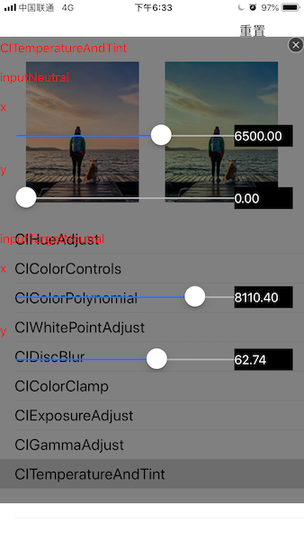

# VisualFilter
##首先为什么要做这个东西,我们都知道CIFilter的基本用法根据名字初始化一个CIFilter对象,然后blabla设置一堆属性,设置输入图片,然后就可以去获取输出的图像了,那这里就有一个问题了,设计根据原图自己设计出来了一种滤镜效果要你实现,并没有告诉你rgb如何变化,饱和度,透明度等怎么变化,这是你该怎么做呢?去浩瀚的ios滤镜中一个一个尝试?问题是大部分的滤镜都是需要给出参数的,有CIVector,CIColor,NSNumber等等,范围如此之大,该如何着手呢,着实让人蛋疼不已,为解决此问题,对滤镜进行可视化.
达到的效果:
新增一种滤镜可视效果,只需要在json中增加配置如下:
```
{
        "filterName":"CIColorPolynomial",
        "attributes":[
            {
                "name": "inputRedCoefficients",
                "type": "CIVector",
                "defaultValues": [0,1,0,0],
                "max":[1,5,2,2],
                "min":[-1,-5,-2,-2]
            },
            {
                "name": "inputGreenCoefficients",
                "type": "CIVector",
                "defaultValues": [0,1,0,0],
                "max":[1,5,2,2],
                "min":[-1,-5,-2,-2]
            },
            {
                "name": "inputBlueCoefficients",
                "type": "CIVector",
                "defaultValues": [0,1,0,0],
                "max":[1,5,2,2],
                "min":[-1,-5,-2,-2]
            },
            {
                "name": "inputAlphaCoefficients",
                "type": "CIVector",
                "defaultValues": [0,1,0,0],
                "max":[1,2,2,2],
                "min":[-1,-2,-2,-2]
            }
        ]
    }
```
指定filterName及该滤镜对应参数的信息,参数信息需要指定参数范围,参数类型,参数默认值,参数名,提供这些信息后,就可以直接查看实际效果了.

